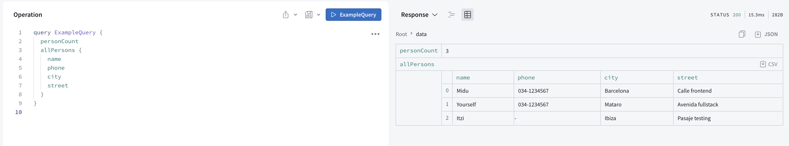

* This project contains an example of graphQL with apollo server
* for more information about:
    *graphQL: https://graphql.org
    *apollo server: https://www.apollographql.com/docs/apollo-server/

* the project has the follow operations
    * Query available people
    * add new person

* Start instructions
    *npm install
    *when the dependencies have been installed we type node index.js to start the project

* Query example in apolloGraphQl studio

